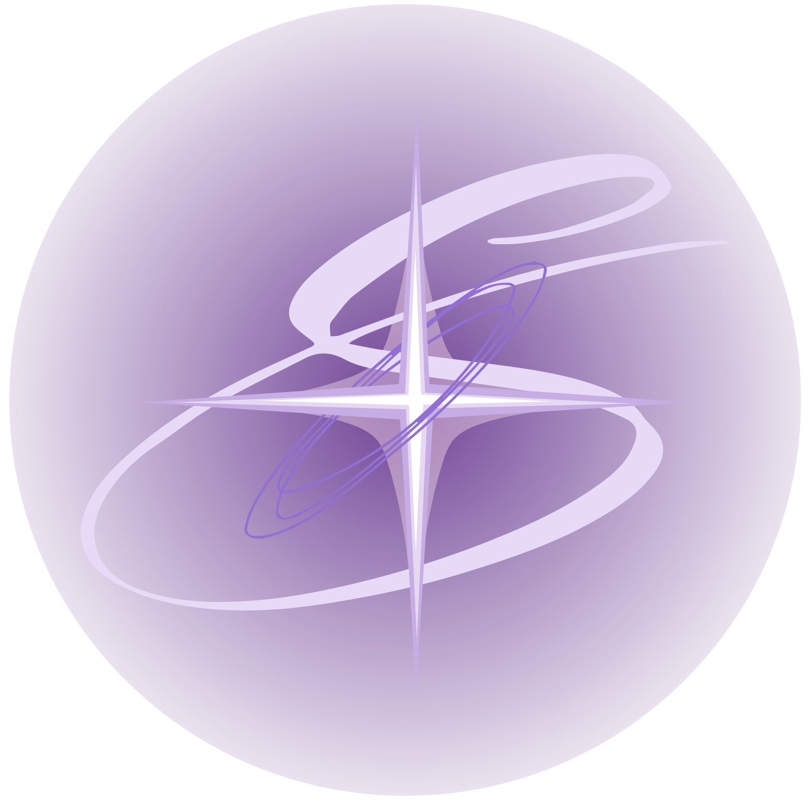

# Supernova: She Speaks
<!-- Improved compatibility of back to top link: See: https://github.com/othneildrew/Best-README-Template/pull/73 -->
<a id="readme-top"></a>
<!--
*** Thanks for checking out the Best-README-Template. If you have a suggestion
*** that would make this better, please fork the repo and create a pull request
*** or simply open an issue with the tag "enhancement".
*** Don't forget to give the project a star!
*** Thanks again! Now go create something AMAZING! :D
-->


<!-- PROJECT SHIELDS -->
<!--
*** I'm using markdown "reference style" links for readability.
*** Reference links are enclosed in brackets [ ] instead of parentheses ( ).
*** See the bottom of this document for the declaration of the reference variables
*** for contributors-url, forks-url, etc. This is an optional, concise syntax you may use.
*** https://www.markdownguide.org/basic-syntax/#reference-style-links


<!-- PROJECT LOGO -->
<br />
<div align="center">
  <a href="https://github.com/aiaag/supernovashespeaks">
    
  </a>

<h3 align="center">Supernova: She Speaks</h3>

  <p align="center">
    Supernova is a social enterprise, combining commercial practices with our driving mission for a world without harmful practices, toxic traditions, and biases against girls and women. We work and serve girls around the world for an equal, free, and bright future, amplifying their voices and profiting business partners through our vision for the greater good.
    <br />
    <a href="https://github.com/aiaag/supernovashespeaks"><strong>Explore the docs »</strong></a>
    <br />
    <br />
    <a href="https://github.com/aiaag/supernovashespeaks">View Demo</a>
    &middot;
    <a href="https://github.com/aiaag/supernovashespeaks/issues/new?labels=enhancement&template=feature-request---.md">Request Feature</a>
  </p>
</div>


<!-- TABLE OF CONTENTS -->
<details>
  <summary>Table of Contents</summary>
  <ol>
    <li>
      <a href="#about-the-project">About The Project</a>
      <ul>
        <li><a href="#built-with">Built With</a></li>
      </ul>
    </li>
    <li>
      <a href="#getting-started">Getting Started</a>
      <ul>
        <li><a href="#prerequisites">Prerequisites</a></li>
        <li><a href="#installation">Installation</a></li>
      </ul>
    </li>
    <li><a href="#usage">Usage</a></li>
    <li><a href="#roadmap">Roadmap</a></li>
    <li><a href="#contributing">Contributing</a></li>
    <li><a href="#license">License</a></li>
    <li><a href="#contact">Contact</a></li>
    <li><a href="#acknowledgments">Acknowledgments</a></li>
  </ol>
</details>


<!-- ABOUT THE PROJECT -->
## About The Project

<p align="right">(<a href="#readme-top">back to top</a>)</p>


### Built With

* [![Twine][Twine-img]][Twine-url]
* [](https://dart.dev/)
* [](https://flutter.dev/)
* [](https://maps.google.com/)
* [](https://www.google.com/forms/about/)


<p align="right">(<a href="#readme-top">back to top</a>)</p>


<!-- GETTING STARTED -->
## Getting Started


### Prerequisites

This project uses different platforms and tools. You don’t need to install everything — just make sure you have access to:
* Flutter SDK (https://docs.flutter.dev/get-started/install)
* Dart SDK (usually bundled with Flutter)
* Android Studio or VS Code (with Flutter & Dart extensions)
* An emulator or physical device for testing
* A web browser – To view Twine stories, Google Forms, and embedded Maps.
* Google Account – To view or interact with Google Forms or Maps embeds, if required.

### Installation
* Clone the repo
   ```sh
   git clone https://github.com/AiaaG/SupernovaSheSpeaks.git
   ```

<p align="right">(<a href="#readme-top">back to top</a>)</p>


<!-- USAGE EXAMPLES -->
## Usage & Roadmap
The homepage, named "Girls' Galaxy" is used to help users navigate through the app. There are three main features:
* "Shining Stars"
  Our main functionality, where interactive, story-based, real-life stories shine--just like the stars.
  Simply click on the location you wish to play in and immersive yourself into the world of women.
* "Secret Stars"
  An option for users to share their stories, and if willing, contribute it to our global map of stories.
  Use the Google Form to share, contribute, and connect!
* "Support Centers"
  Supernova's unique feature, offering a global map of various support organizations, centers, and locations.
  Click on the closest location to you and visit the address! Other additional information, like email and phone number may also be listed.

  See the [open issues](https://github.com/AiaaG/SupernovaSheSpeaks/issues) for a full list of proposed features (and known issues).

<p align="right">(<a href="#readme-top">back to top</a>)</p>

<!-- CONTRIBUTING -->
## Contributing

Contributions are what make the open source community such an amazing place to learn, inspire, and create. Any contributions you make are **greatly appreciated**.

If you have a suggestion that would make this better, please fork the repo and create a pull request. You can also simply open an issue with the tag "enhancement".
Don't forget to give the project a star! Thanks again!

1. Fork the Project
2. Create your Feature Branch (`git checkout -b feature/AmazingFeature`)
3. Commit your Changes (`git commit -m 'Add some AmazingFeature'`)
4. Push to the Branch (`git push origin feature/AmazingFeature`)
5. Open a Pull Request

<p align="right">(<a href="#readme-top">back to top</a>)</p>

### Top contributors:

<a href="https://github.com/AiaaG/SupernovaSheSpeaks/graphs/contributors">
  
</a>

<!-- LICENSE -->
## License
This project is proprietary. All rights reserved © Supernova: She Speaks, 2025.  
Use of this code, story files, or design elements is not permitted without explicit permission.  
Educational showcase only.
See `LICENSE` for more information.

<p align="right">(<a href="#readme-top">back to top</a>)</p>


<!-- CONTACT -->
## Contact

* Twitter/X: [@supernova4girls](https://twitter.com/@supernova4girls)
* E-mail: supernovashespeaks@gmail.com
* Instagram: https://www.instagram.com/supernova_she_speaks/
* Project Link: [https://github.com/AiaaG/SupernovaSheSpeaks](https://github.com/AiaaG/SupernovaSheSpeaks)

<p align="right">(<a href="#readme-top">back to top</a>)</p>

<!-- ACKNOWLEDGMENTS -->
## Acknowledgments

* We would like to acknowledge the unwavering support and guidance of our mothers throughout this important initiative.
* We are thankful to our mentor, Arun Saxena, for his exceptional guidance and support throughout the development of this project.
* We are grateful for our mentor, Cassandra Mok for her invaluable advice throughout the development of this project.


<p align="right">(<a href="#readme-top">back to top</a>)</p>


<!-- MARKDOWN LINKS & IMAGES -->
<!-- https://www.markdownguide.org/basic-syntax/#reference-style-links -->
[contributors-shield]: https://img.shields.io/github/contributors/AiaaG/SupernovaSheSpeaks.svg?style=for-the-badge
[contributors-url]: https://github.com/AiaaG/SupernovaSheSpeaks/graphs/contributors
[forks-shield]: https://img.shields.io/github/forks/AiaaG/SupernovaSheSpeaks.svg?style=for-the-badge
[forks-url]: https://github.com/AiaaG/SupernovaSheSpeaks/network/members
[stars-shield]: https://img.shields.io/github/stars/AiaaG/SupernovaSheSpeaks.svg?style=for-the-badge
[stars-url]: https://github.com/AiaaG/SupernovaSheSpeaks/stargazers
[issues-shield]: https://img.shields.io/github/issues/AiaaG/SupernovaSheSpeaks.svg?style=for-the-badge
[issues-url]: https://github.com/AiaaG/SupernovaSheSpeaks/issues
[license-shield]: https://img.shields.io/github/license/AiaaG/SupernovaSheSpeaks.svg?style=for-the-badge
[license-url]: https://github.com/AiaaG/SupernovaSheSpeaks/blob/master/LICENSE.txt
[Twine-img]: https://img.shields.io/badge/Twine-0066cc?style=for-the-badge&logo=data:image/svg+xml;base64,<base64logo>&logoColor=white
[Twine-url]: https://twinery.org/
